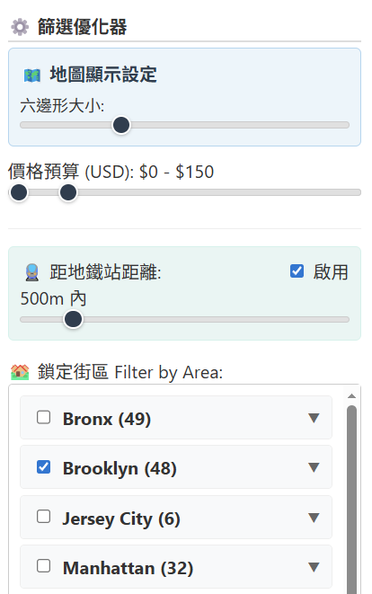
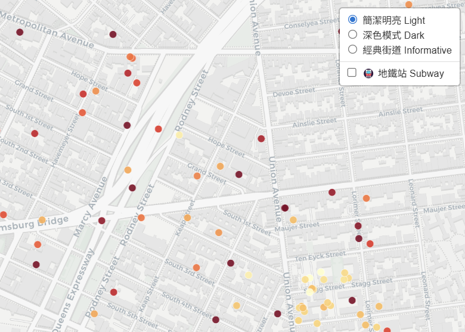
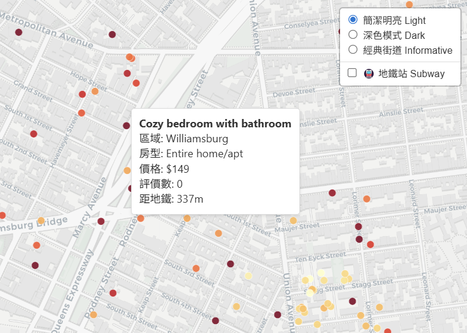

# NYC Airbnb Price & Rating Visualization Report (Data Visualization Final Project)

**Members**:
- 41247048S Hsieh Yu-Hsuan
- 41247062S Hung Ting-An
- 41247006S Chang Cheng-Yi
- 41171218H Huang Yu-Chien

**GitHub Repository**: [https://github.com/ArthurArthurArthur0817/Data-Visualization](https://github.com/ArthurArthurArthur0817/Data-Visualization)

## Abstract
This project aims to explore the distribution, price trends, and their correlation with reviews and geographical locations of NYC Airbnb listings in late 2025 through interactive data visualization techniques. We designed a map visualization system based on Hexagonal Binning to handle a large dataset of approximately 24,091 listings, effectively resolving the issue of overplotting. Enhanced with dynamic filters such as price validation, subway distance, and neighborhood selection, along with statistical charts, the system provides an intuitive and efficient tool for users to explore the data. This report details the data processing workflow, system design philosophy, implementation details, and use case analysis.

## I. Introduction
### Background and Motivation
Airbnb has become a significant option for modern travel accommodation. However, for tourists, finding a listing that is both affordable, well-rated, and conveniently located is a challenge. As a global tourism hotspot, New York City has a vast and complex distribution of listings, making it difficult to get a comprehensive view through simple list-based searches.

### Problem Statement and Target Users
The target users of this project are **tourists planning to visit NYC** and **analysts interested in the NYC real estate or hospitality market**.
Our visualization system aims to assist users in three main areas:
1.  **Identifying Price Hotspots**: Quickly visualizing which areas are overpriced or affordable.
2.  **Finding High CP Value Listings**: Combining review counts and prices to find listings that offer great value.
3.  **Evaluating Transport Convenience**: Filtering listings based on proximity to subway stations, catering to independent travelers.

## II. Data and Data Processing
### Data Source
The data source for this project is **Inside Airbnb**. We manually downloaded the compressed CSV files for New York City and surrounding areas (including `newyork_listings.csv.gz`, `jersey_city_listings.csv.gz`, and `newark-newjersy_listings.csv.gz`) and placed them in the `data/raw/` directory. These files were then integrated and preprocessed.
-   **Data Volume**: The cleaned dataset contains approximately **24,091** valid listings.
-   **Key Attributes**: Latitude, Longitude, Price, Neighbourhood Group, Room Type, and Number of Reviews.
-   **Supplementary Data**: NYC Subway Stations GeoJSON, used to calculate the distance between listings and subway stations.

### Data Preprocessing
To improve visualization performance and accuracy, we performed the following steps:
1.  **Data Cleaning**: Removed invalid data with zero price or abnormal coordinates.
2.  **Spatial Calculation**: Calculated the straight-line distance from each listing to the nearest subway station and added the `dist_to_subway` attribute for filtering.
3.  **Hierarchical Structuring**: Established a **Borough to Neighborhood** hierarchy for the sidebar selection filter.

## III. Target User and Task Requirement
We defined the following core tasks for our target users:
-   **[T1] Distribution Overview**: Users can observe the geographical density distribution of listings on the map.
-   **[T2] Price Exploration**: Users can identify regional differences between high and low housing prices.
-   **[T3] Conditional Filtering**: Users can filter by budget, room type, and subway distance to narrow down choices.
-   **[T4] Details on Demand**: Users can view detailed information such as name and real-time price of specific listings of interest.
-   **[T5] Trend Analysis**: Users can compare listing counts and cost-performance ratios across different areas through statistical charts.

## IV. Visualization Design and Implementation
The system is built using a **Web** architecture, utilizing HTML, CSS, and JavaScript, and incorporates **D3.js** and **Leaflet.js**.

### 1. Main Map View
-   **Hexagonal Binning**:
    -   Since there are over 24,000 listings, plotting all points directly would cause severe overplotting. We used hexagonal binning to aggregate adjacent listings.
    -   **Color Encoding**: The shade of the hexagons represents the average price or listing density. Darker colors indicate higher prices or density.
    -   **Dynamic Radius**: Users can adjust the hexagon size via the right panel to change the aggregation granularity.
-   **Semantic Zooming**:
    -   When users **Zoom In** to a certain level, the hexagons fade out to reveal individual **Listing Points**.
    -   This allows seamless switching between a macro overview and micro details.
-   **Subway Capability Integration**:
    -   Subway station locations are overlaid on the map, displayed as **white dots with black borders**, to help reference transport convenience.

### 2. Sidebar Control Panel
To support task [T3], we designed a robust **Filter Optimizer** on the right side:
-   **Map Display Settings**:
    -   **Hexagon Size**: A slider to control aggregation level.
    -   **Theme Switch**: Provides Light, Dark, and Informative map styles for different contexts.
-   **Price Budget**:
    -   **Range Slider**: Allows users to set minimum and maximum price limits such as $100 to $300, updating the map and charts in real-time.
-   **Distance to Subway**:
    -   Includes an **Enable Toggle** and a **Distance Slider**. When enabled, it only shows listings within a specified specific range (e.g., 500m) of a subway station, which is crucial for travelers without cars.
-   **Filter by Area**:
    -   **Hierarchy Checkbox**: Lists NYC's five Boroughs and all their subordinate Neighborhoods. Users can check specific neighborhoods like Midtown in Manhattan to exclude noise.

### 3. Statistical Charts
The chart area at the bottom right provides analytical perspectives:
### 3. Statistical Charts
The chart area at the bottom right provides analytical perspectives:

#### Listing Count Statistics (Bar Chart)
-   Shows the total number of listings by Borough or Neighborhood. Users can switch the grouping level.
-   **Interaction**: Clicking on a bar zooms the map to that specific area.

#### CP Value Analysis (Price vs Rating Scatter Plot)
-   **X-Axis**: Number of Reviews, representing popularity.
-   **Y-Axis**: Price.
-   **Color Encoding**: Points are colored by Borough (e.g., **Blue indicates Brooklyn**). Each bubble represents a distinct **Neighborhood** within that Borough.
-   **Interaction**: Supports **Brush to Filter**. Users can drag a selection box to select a cluster of neighborhoods with specific price/rating characteristics. **This automatically filters the map to display only the selected neighborhoods.**
-   **Purpose**: Helps identify "High CP Value" listings located in the bottom-right quadrant, which corresponds to High Rating and Low Price.

## V. Use Cases
We demonstrate the value of our visualization through two distinct scenarios: one for individual tourists and another for market analysts.

### Case 1: The Tourist - Finding "Hidden Gem" Accommodation
**Goal**: Alice plans to visit NYC with a budget of $150/night. She wants to stay in **Brooklyn** but needs to be within walking distance of a subway station.
1.  **Global Filter**: Alice checks "Brooklyn" in the **Filter by Area** hierarchy and sets the **Price Budget** slider to $0-$150.
2.  **Transport Constraint**: She enables the **Distance to Subway** toggle and sets the slider to **500m**. The map immediately updates, removing inconvenient listings.
3.  **Visual Exploration**: She **zooms in** to the **Williamsburg** area. The map transitions from hexagons to individual **red points (listings)**.
4.  **Detail Verification**: Hovering over the points, she compares the "Price" and "Rating" in the tooltip. She successfully finds a "Private Room" listing priced at $118 with a 4.9-star rating, which would have been buried in a traditional list view.

### Case 2: The Analyst - Discovering High CP Value Neighborhoods
**Goal**: Bob, a real estate analyst, wants to know **"Which neighborhoods in NYC offer the best value for money?"** (High Rating + Low Price).
1.  **Macro Analysis (Scatter Plot)**: Instead of starting with the map, Bob looks at the **Scatter Plot (CP Value Analysis)**. He observes a distribution of bubbles where the X-axis is popularity (reviews) and Y-axis is price.
2.  **Interaction (Brush to Filter)**: He is interested in the "High Value Zone" — listings with **High Ratings (> 4.5)** but **Low Prices (< $150)**. He uses the mouse to **brush (drag a box)** over the bottom-right quadrant of the chart (as shown in Fig 5a).
3.  **Insight Discovery**:
    -   The Scatter Plot highlights the selected bubbles.
    -   Crucially, **the Map simultaneously filters** to show only the listings belonging to these high-value clusters (Fig 5c).
4.  **Conclusion**: Bob discovers that these high-value listings are heavily concentrated in **Astoria** (Queens) and specific parts of **Brooklyn**, rather than Manhattan. This spatial insight is instantly revealed by the interaction between the chart and the map.

*(Note: Refer to the comprehensive 4-step interaction figure in the Statistical Charts section)*

## VI. Conclusion and Discussion
This project successfully implemented a visualization system integrating maps, filters, and statistical charts.
-   **Strengths**: Hexagonal binning effectively solves the display issue of massive data points; multidimensional filters significantly enhance the utility of data exploration.
-   **Limitations**: Currently uses static data from late 2025, which cannot reflect weekly real-time market changes.
-   **Future Work**: Incorporate a timeline feature to observe seasonal price trends or integrate real-time APIs to fetch live listing status.

---
*Report generated for Data Visualization Course (Fallback 2024)*
